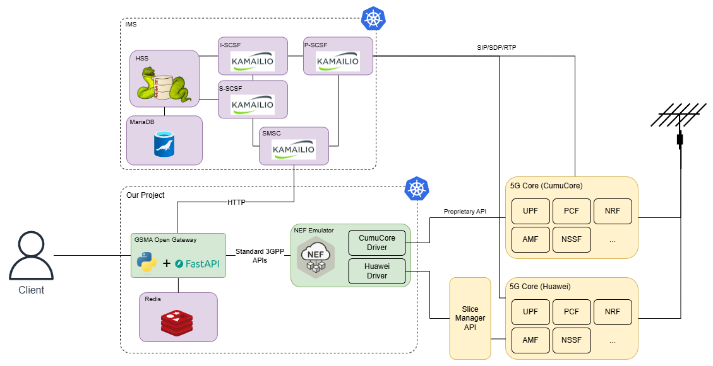

# Architecture

<!--toc:start-->
- [Architecture](#architecture)
  - [Ideal Architecture](#ideal-architecture)
  - [Real Architecture](#real-architecture)
<!--toc:end-->

In this section, our project's architecture will be presented as well as a
brief explanation on the decisions made and the current landscape that lead to
those decisions.

## Ideal Architecture

In an ideal world, our architecture would look something like the following:

Here the existing infrastructure would provide a 5G core that is compliant with
the 3GPP standards, providing APIs to interact with the relevant network
functions that would be consistent from core to core. Furthermore, Short
Message Services (SMS) would be available and exposed programmatically for use.

In this scenario, our work would be relatively simple. We would need to deploy
an SMS Centre (SMSC) that would connect to the standards compliant core and
handle storing and forwarding SMSs while also providing an interface to do so
programmatically to our service. This component, while not developed by us,
would be configured, packaged and deployed by us.

Then the GSMA Open Gateway would be developed by us and talk to the 5G Core and
SMSC using the standardized interfaces. This would allow our project to talk to
any core as long as they followed the standards, increasing the portability of
our solution. This component would be what the vertical customers would
interact with, and would be assisted by a Redis database to keep track of some
state between requests.

All this work would be packaged through the use of Helm Charts that would allow
the deployment of this solution to a Kubernetes cluster. This would further
allow offering our solution as a service, as the chart could be installed
multiple times with tweaked values for each client.

## Real Architecture

However, reality isn't as simple. There are some problems with our idealized
architecture:

- Not all cores are standards compliant. Many of them provide only proprietary
  APIs and some don't even provide APIs and only provide graphical or command
  line interfaces.
- Not all functionality is supported by the cores. In a real world scenario,
  the gateway would simply not offer some services that were dependent on
  these. However, as we are interested in exploring what kind of applications
  could be offered through the GSMA Open Gateway API, emulating the missing
  functionality is more advantageous to us.
- Telephony services such as messaging (through SMS) and even voice calling is
  viewed as an additional service in 5G networks, which mainly concerns itself
  with providing connectivity.

To address these problems, the following architecture was devised.

Now, a NEF Emulator will be deployed to emulate functionality that isn't provided by the cores currently available at IT Aveiro, mainly location APIs. Furthermore, it will also be used to communicate with the different cores through different drivers, each for their respective core. One could interface standards compliant cores, others could support proprietary APIs exposed by the cores (as seen in the case of CumuCore), and finally there could be implementations that talk to middlewares that wrap the interfaces of cores that don't have APIs (as is the case for the Huawei implementation).

Moreover, instead of the gateway communicating directly to the core, it would comunicate with 3GPP compliant interfaces presented by the NEF Emulator.

Finally, to provide telephony services an IP Multimedia Subsystem (IMS) will be
deployed. This set of components allows the user equipment (mobile phones) to
place calls and exchange messages with the aid of the SMSC. The IMS comprises
multiple Call Session Control Functions (CSCF) that each take on a different
role: Proxy (P-CSCF), Interrogating (I-CSCF), and Serving (S-CSCF).
Additionally, a Home Subscriber Server (HSS) based on PyHSS with a MariaDB is
required by the CSCFs for authentication and tracking of clients. All of this
infrastructure will be configured and deployed by us as a Helm Chart. The
inclusion of IMS is required because the cores don't provide these services by
themselves, and we intend to implement the OTP SMS APIs, which require the
sending of SMSs.

As was the case in the ideal architecture, all components of our project will
be packaged in a Helm Chart (one for our project specific components and
another for the IMS), to allow deployment on a Kubernetes cluster. As stated
before, this also opens the door to offering everything as a service.
