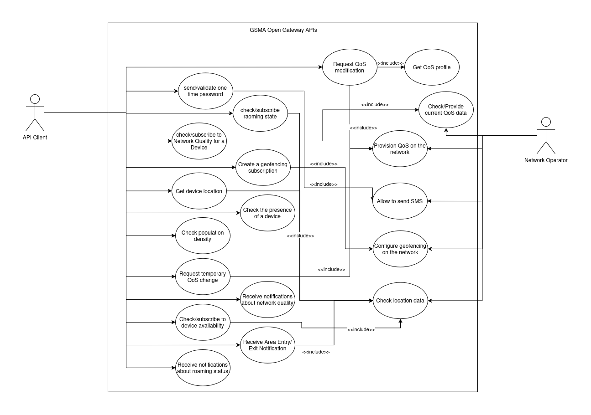

# Actors

**Network Operator** – The first actor to interact with the system is the network operator, who provides APIs to various other businesses so they can interact with the network programmatically. However, considering that the APIs designed by the GSMA Open Gateway are considerably simpler than those defined by 3GPP, a network operator can also use these APIs to manage its own network.

**Vertical Client** – The second actor to interact with the system is, in fact, its target audience. Various businesses develop a set of products that interact with the network. These businesses use the APIs defined by the GSMA Open Gateway not only to offer a broader range of functionalities to their users but also to perform a set of verifications to ensure the correct usage and performance of their products.

# Use Case Diagram

### Network Operator

The network operator, despite being able to interact directly with the 5G core, can use the APIs it provides to more easily manage the quality of service of its network.

### API Client

The API clients are various businesses that aim to programmatically modify the network, either to offer better products/services to their customers or to manipulate an internal network to better suit their needs. Using the APIs defined by the GSMA Open Gateway, these businesses can:

1. Send/Validate One Time Passwords (OTPs), for example, to verify the validity of a phone number via SMS.
2. Check or subscribe to roaming status to determine if a device is in another country.
3. Check and/or subscribe to the network quality for a specific device to ensure the application’s network requirements can be met. If subscribed, a notification will be sent whenever there is a change in quality.
4. Obtain the location of a given device.
5. Verify the presence of a device, meaning checking whether a specific device is within a defined area.
6. Check the population density in a given area.
7. Request a temporary or permanent QoS (Quality of Service) change due to the need for higher bandwidth.
8. Receive notifications about network status.
9. Receive notifications regarding a device entering or leaving a given area.
10. Subscribe to or check the availability of a device.
